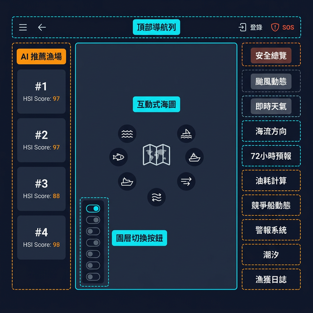
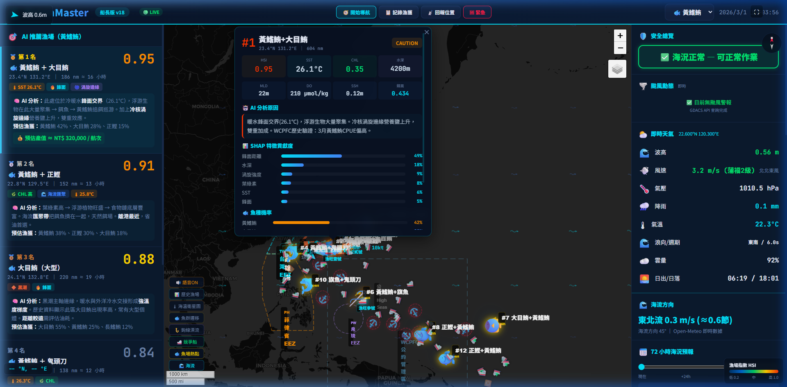

# ⚓ OceanMaster 船長決策儀表板 — 使用說明書

> **版本：v13.2 船長版** ｜ 更新日期：2026-03-01

---

## 📐 儀表板總覽佈局





儀表板分為 **五大區域**：

| 區域 | 位置 | 功能 |
|------|------|------|
| **頂部導航列** | 最上方橫列 | 快捷操作、魚種選擇、時間顯示 |
| **AI 推薦漁場** | 左側面板 | HSI 排名卡片（#1~#12） |
| **互動式海圖** | 中央主區域 | 地圖、漁場標記、海域邊界 |
| **圖層切換按鈕** | 地圖左下角 | 開關 8 種圖層 |
| **安全 & 環境面板** | 右側面板 | 天氣、颱風、海流、警報等 10 項 |

---

## 一、頂部導航列

```
┌─────────────────────────────────────────────────────────────────────┐
│ ◀ 波高0.6m │ OceanMaster │ 船長版v18 │ 🔴LIVE │ 🧭開始導航 │ 📋記錄漁獲 │ 📡回報位置 │ 🆘緊急 │ [黃鰭鮪▼] │ 日期時間 │
└─────────────────────────────────────────────────────────────────────┘
```

| 按鈕 | 快捷鍵 | 說明 |
|------|--------|------|
| 🧭 **開始導航** | `Alt+N` | 設定航線到選定漁場，地圖自動繪製航線 |
| 📋 **記錄漁獲** | `Alt+L` | 填報投繩數、魚種、重量，自動計入漁獲日誌 |
| 📡 **回報位置** | `Alt+R` | 手動回報 VMS 位置給岸端管理系統 |
| 🆘 **緊急** | — | 一鍵觸發 SOS 求救訊號（必須確認才發送） |
| 🐟 **魚種選擇** | — | 右上下拉選單切換目標魚種，AI 漁場即時重算 |

> [!TIP]
> 左上角常駐顯示即時波高，讓你不用切換畫面也能隨時掌握。

---

## 二、AI 推薦漁場（左側面板）

每張卡片代表一個 AI 推薦漁場，按 **HSI（棲息地適合度指數）** 由高到低排序。

### 卡片資訊解讀

```
┌──────────────────────────────────┐
│ 🐟 第1名                  0.95  │  ← HSI 分數（0~1，越高越好）
│ 黃鰭鮪 ＋ 大目鮪                │  ← 主要魚種
│ 23.4°N 131.2°E │ 186 nm ≈ 16小時│  ← 座標 / 離港距離 / 預估航行時間
│ [SST 26.1°C] [鋒面] [渦旋邊緣]  │  ← 環境特徵標籤
│                                  │
│ 🤖 AI分析：此處位於冷暖水鋒面    │  ← AI 用自然語言解釋推薦原因
│    交界(26.1°C)，浮游生物...     │
│ 預估漁獲：黃鰭鮪42%、大目鮪28%  │  ← 各魚種捕獲機率
│ 💰 預估產值 ≈ NT$ 320,000 / 航次│  ← 經濟效益估算
└──────────────────────────────────┘
```

### 環境特徵標籤說明

| 標籤 | 含義 |
|------|------|
| 🌡 **SST** | 海表溫度（°C），AI 判斷魚種偏好溫度 |
| 🌊 **鋒面** | 冷暖水交界處，餌料聚集區 |
| 🌀 **渦旋邊緣** | 冷/暖核渦旋，營養鹽上升區 |
| 🟢 **CHL 高** | 葉綠素濃度高，浮游植物旺盛 |
| 💧 **海流匯聚** | 洋流匯聚帶，天然餌場 |

> [!NOTE]
> 點擊左側任意卡片，地圖會自動飛到該漁場並展開詳細分析彈窗。

---

## 三、互動式海圖（中央區域）

### 3.1 基本操作

| 操作 | 方式 |
|------|------|
| **平移** | 滑鼠拖拽 / 觸控拖拽 |
| **縮放** | 滾輪 / `+` `-` 按鈕 / 雙指捏合 |
| **查詢天氣** | 點擊地圖任意海域 → 右側即時更新天氣 |
| **圖層疊加** | 右上角 Leaflet 圖層選擇器 |

### 3.2 地圖標記圖示

| 圖示 | 代表 |
|------|------|
| 🔴🟠🟡 **圓圈標記** | AI 推薦漁場（顏色越深 HSI 越高） |
| `#1 黃鰭鮪+大目鮪` | 漁場編號 + 魚種標籤 |
| 🚢 | 競爭船舶 / 我方船隊 |
| ⚓ | 疑似作業中的船隻（停留>30分鐘） |
| 📳 | 訊號中斷的船隻 |
| ▶ 🟡箭頭 | 魚群24小時預測遷移方向 |
| 🌊 波浪箭頭 | 海流方向和流速 |
| 🔵 虛線圈 | 颱風警戒範圍 |
| ━━ 粉紅虛線 | 各國 EEZ 經濟海域界線 |

### 3.3 漁場詳細分析彈窗

點擊地圖上任何漁場標記，會展開深度分析：

```
┌─────────────────────────────────────┐
│ #1 黃鰭鮪+大目鮪          CAUTION  │
│ 23.4°N 131.2°E │ 604 nm           │
├─────────────────────────────────────┤
│ HSI    SST     CHL    水深         │
│ 0.95   26.1°C  0.35   4200m       │
│ MLD    DO      SSH    鋒面         │
│ 22m    210     0.12   0.434       │
├─────────────────────────────────────┤
│ 🤖 AI 分析原因                      │
│ 暖水鋒面交界(26.1°C)，浮游生物...   │
├─────────────────────────────────────┤
│ 📊 SHAP 特徵貢獻度                  │
│ 鋒面距離 ████████████████████ 49%  │
│ 水深     ███████        18%        │
│ 渦旋強度 ████           9%         │
│ 葉綠素   ████           8%         │
├─────────────────────────────────────┤
│ 🐟 魚種機率                         │
│ 黃鰭鮪 ██████████████   42%       │
│ 大目鮪 █████████         28%       │
├─────────────────────────────────────┤
│ 🔬 科學洞察                         │
│ 🌑 新月 — 集魚燈效果佳、表層餌料多  │
│ 🌊 收斂帶 — 餌料聚集區              │
│ 🔥 溫度鋒面 — 獵物聚集帶            │
└─────────────────────────────────────┘
```

### 🔬 科學洞察 Badge 說明

點擊漁場彈窗底部會根據即時環境數據自動顯示科學洞察 badge：

| Badge | 觸發條件 | 船長建議 |
|-------|---------|----------|
| 🌑 **新月** | 月相光照 < 20% | 集魚燈效果佳、表層餌料多 |
| 🌕 **滿月** | 月相光照 > 80% | 建議深放鉤、表層 DVM 抑制 |
| 🌊 **收斂帶** | 海流收斂指數 > 0.3 | 餌料自然聚集區 |
| 🏔️ **海底山** | 距海底山 < 100km | Taylor column 上湧流，營養鹽豐富 |
| 🔥 **溫度鋒面** | 鋒面強度 > 0.05 | 獵物聚集帶，冷暖水交界 |
| 🌿 **颱風後增殖** | 颱風後 CHL 爆發 > 0.3 | 營養鹽上湧，浮游生物增殖中 |

**關鍵指標說明：**

| 指標 | 全名 | 說明 |
|------|------|------|
| **HSI** | Habitat Suitability Index | 0~1，綜合環境適合度評分 |
| **SST** | Sea Surface Temperature | 海表溫度（°C） |
| **CHL** | Chlorophyll-a | 葉綠素-a 濃度（mg/m³） |
| **MLD** | Mixed Layer Depth | 混合層深度（m），影響下鉤策略 |
| **DO** | Dissolved Oxygen | 溶氧量（µmol/kg） |
| **SSH** | Sea Surface Height | 海面高度異常，渦旋指標 |
| **鋒面** | SST Front Gradient | 鋒面梯度強度（°C/km） |
| **SHAP** | SHapley Additive exPlanations | AI 可解釋性 — 各因子對預測的貢獻度 |

---

## 四、圖層切換按鈕（地圖左下角）

8 個按鈕可獨立開關，控制地圖上顯示的資訊圖層。
**關閉時圖層完全消失，30秒自動更新也不會再跳回來。**

| 按鈕 | 預設 | 功能說明 |
|------|------|---------|
| 🔊 **語音ON/OFF** | ✅開 | 關閉後不再播報語音警報 |
| 📊 **歷史漁場** | ❌關 | 疊加 WCPFC 歷史 CPUE 熱力圖 |
| 🌡 **海溫衛星圖** | ❌關 | 即時 SST 色階圖層 |
| 🐟 **魚群遷移** | ✅開 | 顯示 AI 預測的 24h 魚群遷移箭頭 |
| 🪝 **鉤線漂流** | ❌關 | 顯示延繩鉤在洋流中的漂流預測 |
| 🚢 **競爭船** | ✅開 | 顯示/隱藏所有競爭船舶和我方船隊 |
| 🐟 **魚場熱點** | ✅開 | 顯示/隱藏 AI 漁場標記 |
| 🌊 **海流** | ✅開 | 顯示/隱藏海流方向箭頭 |

> [!IMPORTANT]
> 按鈕顏色反映狀態：**亮色 = 開啟**，**灰色 = 關閉**。
> 一旦關閉，定時更新（每30秒）也不會讓圖層跳回來。

---

## 五、安全 & 環境面板（右側面板）

右側面板由上往下依序為 10 個功能模組：

### 5.1 🛡 安全總覽
- **綠色「海況正常 — 可正常作業」**：波高<4m、風速<14m/s
- **黃色「注意」**：波高 4~6m 或 風速 14~21m/s
- **紅色「危險 — 建議避航」**：波高>6m 或 風速>25m/s

### 5.2 🌪 颱風動態
- 即時串接 GDACS（全球災害警報系統）
- 顯示活躍颱風名稱、等級、距離和移動方向
- 地圖上自動繪製颱風警戒範圍虛線圈

### 5.3 ⛅ 即時天氣

點擊地圖任意位置後，此區即時更新：

| 項目 | 數據範例 | 來源 |
|------|---------|------|
| 波高 | 2.68 m（綠/黃/橙/紅色標示危險等級） | Open-Meteo Marine API |
| 風速 | 9.5 m/s（蒲福5級）+ 風向 | Open-Meteo Forecast |
| 氣壓 | 1014 hPa | Open-Meteo |
| 降雨 | 0 mm | Open-Meteo |
| 氣溫 | 21.9°C | Open-Meteo |
| 浪向/週期 | 東 / 8.2s | Open-Meteo Marine |
| 雲量 | 46% | Open-Meteo |
| 日出/日落 | 03:51 / 15:30 | Open-Meteo |

### 5.4 🌊 海流方向
- 顯示洋流方向（如「東北東流」）和流速（m/s 及節）
- 來自 Open-Meteo 即時數據

### 5.5 📅 72 小時海況預報
- 滑桿可拖動查看未來 72 小時的海況變化
- 下方長條圖顯示波高趨勢（綠→黃→紅）
- 漁場指數 HSI 同步變化

### 5.6 ⛽ 油耗 ROI 計算器
可調整參數：
- **船速**（6~14 節）
- **油耗率**（30~80 L/nm）
- **油價**

自動計算：航行距離 → 航行時間 → 耗油量 → 油料成本 → 預估漁獲 → **淨利 ROI**

### 5.7 🔥 漁火 & 競爭船動態
- 作業海域總船數
- #1、#2 漁場附近船數（含競爭程度判定）
- 疑似作業中船數
- 訊號中斷船數

### 5.8 🚨 自動警報系統
自動檢測並警報：
- 波高突然上升
- 接近 EEZ 邊界
- 附近異常船隻聚集
- 颱風路徑逼近

兩個按鈕：
- **🔍 立即檢查**：手動觸發一次掃描
- **🔊 語音開啟/關閉**：控制是否播報語音警報

### 5.9 🌊 潮汐資訊
- 點擊地圖後顯示該位置的潮汐預測
- 高潮 / 低潮時間

### 5.10 📋 漁獲日誌
- 顯示最近的漁獲記錄
- 包含日期、魚種、重量

---

## 六、船隻資訊彈窗

點擊地圖上任何船舶圖示，顯示：

```
┌──────────────────────────┐
│ 🇹🇼 海龍號                │  ← 國旗 + 船名
│ MMSI: 407785347 │ 延繩釣  │  ← MMSI 識別碼 + 船型
├──────────────────────────┤
│   速度        航向       │
│  6.0 kt      134°       │
├──────────────────────────┤
│   🎣 疑似作業中           │  ← 狀態判定
│  ⏱ 定點停留 45 分鐘      │  ← 停留時間（作業中才顯示）
│  15.988°N 133.811°E      │  ← 精確座標
└──────────────────────────┘
```

**船隻狀態判定規則：**

| 狀態 | 圖示 | 判定邏輯 |
|------|------|---------|
| 🚢 **航行中** | 綠色 | 速度 ≥ 3 節 |
| ⏸ **停俥** | 黃色 | 速度 < 0.5 節，停留 < 30 分鐘 |
| 🎣 **疑似作業中** | 紅色 | 停留 > 30 分鐘（GFW 標準） |
| 📳 **訊號中斷** | 灰色 | 超過 45 分鐘無 AIS 訊號 |

---

## 七、鍵盤快捷鍵

| 快捷鍵 | 功能 |
|--------|------|
| `Alt + 1~5` | 快速跳到第 1~5 名漁場 |
| `Alt + F` | 全螢幕切換 |
| `Alt + N` | 開始導航 |
| `Alt + L` | 記錄漁獲 |
| `Alt + R` | 回報位置 |
| `+` / `-` | 地圖縮放 |
| 點擊地圖 | 查詢該點天氣、海流、潮汐 |

---

## 八、數據更新頻率

| 數據類型 | 更新頻率 | 來源 |
|---------|---------|------|
| 船隻位置 | 每 30 秒 | 模擬 AIS（未來接 GFW API） |
| 即時天氣 | 點擊觸發 | Open-Meteo API |
| 颱風警報 | 頁面載入時 | GDACS RSS |
| AI 漁場推薦 | 管線執行時更新 | OceanMaster Pipeline |
| 海流方向 | 點擊觸發 | Open-Meteo Marine API |
| 72小時預報 | 點擊觸發 | Open-Meteo Forecast |

---

> **OceanMaster — 讓每一次出海都有數據支持的決策。**
